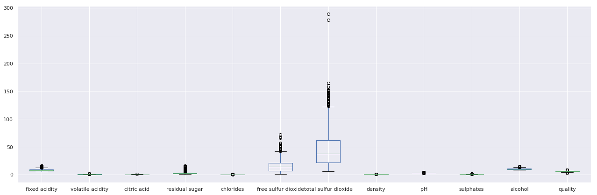
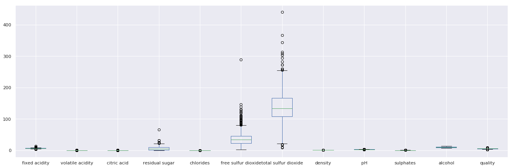

# Bayes-and-KNN-with-wine_quality
So sánh bộ phân lớp Bayes và bộ phân lớp kNN dựa trên thực nghiệm với bộ dữ liệu wine quality. 
## Giới thiệu
Mục đích của bài toán là so sánh độ chính xác của bộ phân lớp Bayes và kNN trên bộ dữ liệu wine quality. 
Bộ dữ liệu bao gồm thông tin về các xét nghiệm hóa lý trên các 2 loại rượu vang đỏ và trắng.
Có 12 feature khác nhau có trong bộ dữ liệu bao gồm dữ liệu về fixed acidity, volatile acidity, citric acid, ph, alcohol,... Tập dữ liệu bao gồm (rượu vang đỏ - 1599 row; rượu vang trắng - 4898 row).
## DATA
| Tên cột           | Chỉ dẫn                                              |
| -------------         |-------------                                             | 
| fixed acidity         | Hàm lượng axit cố định                                    | 
| volatile acidity      | Hàm lượng axit dễ bay hơi                                 |  
| citric acid           | Hàm lượng axit citric tính bằng ml                                | 
| residual sugar        | Hàm lượng đường dư                                   |   
| chlorides             | Hàm lượng clorua                                        |
| free sulfur dioxide   | Hàm lượng lưu huỳnh điôxít tự do                            |
| total sulfur dioxide  | Tổng hàm lượng lưu huỳnh điôxítt                            |
| density               | Tỉ trọng                                                  |
| pH                    | Độ pH                                                 |
| sulphates             | Hàm lượng sunphat                                         |
| alcohol               | Nồng độ cồn tính bằng ml                                    |
| quality               | Chất lượng rượu từ 0 đến 10                 |

| Dữ liệu | Phân bố |
| --- | --- |
| Red wine  |  |
| White wine |  |
